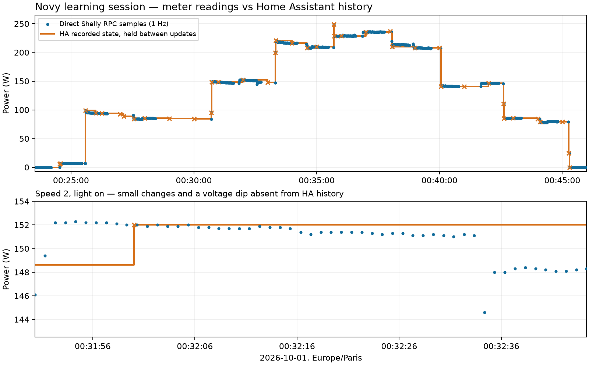

# Novy power learning, 2026-10-01

Installation: Novy 7831, pairing code 1, AZDelivery classic ESP32 CP2102, STX882 on GPIO4, and Shelly Plug M Gen3 (MAC `70AF09E08A6C`).

Commands were sent through the existing HA raw buttons. The user confirmed one speed LED after the first plus and boost after the fourth. Each state was allowed 15 seconds to settle, followed by 40 seconds of fresh readings at 1 Hz. Speeds 1–3 were then measured again with the motor warm for 30 seconds per light state. The plug relay stayed on throughout. The fan and light were returned to off.

## Measured signatures

Initial and repeat runs are combined below. Ranges include a 1 W margin on each side (clamped at zero). These are installation-specific observations, requiring confirmation after upload and under different operating conditions. Brightness must remain the same.

| Speed | Light | Samples | Median W | Observed W | Configured W |
| --- | --- | ---: | ---: | --- | --- |
| 0 | Off | 70 | 0.0 | 0.0–0.0 | 0.0–1.0 |
| 0 | On | 40 | 7.0 | 6.9–7.0 | 5.9–8.0 |
| 1 | Off | 70 | 84.1 | 78.0–85.7 | 77.0–86.7 |
| 1 | On | 70 | 93.7 | 85.3–94.7 | 84.3–95.7 |
| 2 | Off | 70 | 146.9 | 140.8–148.6 | 139.8–149.6 |
| 2 | On | 70 | 148.1 | 144.6–152.0 | 143.6–153.0 |
| 3 | Off | 70 | 208.8 | 206.7–210.5 | 205.7–211.5 |
| 3 | On | 70 | 215.7 | 212.5–218.0 | 211.5–219.0 |
| 4 | Off | 40 | 228.9 | 228.0–230.7 | 227.0–231.7 |
| 4 | On | 40 | 235.5 | 235.1–236.3 | 234.1–237.3 |

## Ambiguity

Mains voltage varied from 227.9 to 235.5 V during this session, and warm-motor consumption was lower than the initial readings. The following inclusive ranges overlap; the controller reports `ambiguous_power` there and leaves full/light feedback invalid. Fan targets can still use independently confirmed speed:

- Speed 1 off / speed 1 on: 84.3–86.7 W.
- Speed 2 off / speed 2 on: 143.6–149.6 W.
- Speed 3 off / speed 3 on: 211.5–211.5 W.

This table does not prove every light state can always be distinguished from watts alone. Overlaps are preserved rather than shrinking ranges to exclude genuine readings. Outside all ranges, feedback is also invalid. The AZDelivery profile now permits the remembered-state light fallback described below. Long-term physical acceptance remains pending.

## Fresh feedback

The HA path delivered faster changes during transitions but sparse updates while consumption settled. The comparison below separates unchanged history entries from missing small meter changes. This left the original 3-second averaging windows empty. The prepared AZDelivery profile reads fresh Shelly status directly each second after upload, checks its MAC, relay state, errors and numeric power, and publishes NaN on a failed or invalid response. No cached heartbeat is generated.

The original learning build used 4-second averaging windows, a 10-second stale timeout, 15-second settling after RF completion, and a 40-second step timeout. Two confirming windows are still required. That original build blocked every target through ambiguity; the control update below supersedes that behavior.

The implementation uses [Shelly status RPC](https://shelly-api-docs.shelly.cloud/gen2/ComponentsAndServices/Switch/) and [ESPHome HTTP response capture](https://esphome.io/components/http_request/). Reserve `10.10.10.183` for this plug in DHCP; the identity check rejects a different device at that address.

## Comparison with Home Assistant

Queried the recorder's raw state history for `sensor.prise_hotte_power` over
00:23:00–00:46:30 Europe/Paris, with attributes included, significant-change
filtering disabled, and no long-term statistics aggregation. All 41 returned
points were fetched; there was no pagination truncation. The direct recording
contains 850 fresh samples in 17 measurement blocks during this period.
History points and meter samples have different meanings: history includes an
initial carried state and omits identical state reports, so these counts alone
are not a numeric decimation factor.

Of the HA updates with direct samples within 1.5 seconds, **30/30 matched an
exact Shelly wattage**. The allowance covers independent acquisition timing and
transport delay, including fast transitions. No extra averaging or change of
numeric precision was found. The entity is the native `shelly` platform with
empty integration options; its whole-watt display preference does not round
the decimal states stored in history.

The installed HA version is 2026.9.3, using aioshelly 13.32.0. Its
[power sensor](https://github.com/home-assistant/core/blob/2026.9.3/homeassistant/components/shelly/sensor.py#L484)
reads `switch:0.apower`; the
[attribute getter](https://github.com/home-assistant/core/blob/2026.9.3/homeassistant/components/shelly/entity.py#L582)
passes that field through without a value transform. The
[HA coordinator](https://github.com/home-assistant/core/blob/2026.9.3/homeassistant/components/shelly/coordinator.py#L810)
and [aioshelly notification handler](https://github.com/home-assistant-libs/aioshelly/blob/13.32.0/aioshelly/rpc_device/device.py#L180)
forward received status notifications without a power averaging or throttle
stage.

There **is substantial reduction in the update cadence**. Updates arrived
about one second apart during some transitions and often about 60 seconds apart
while settled. Small but genuine changes were absent from history:

| Measurement block | Direct steady readings | Direct range | New HA points in that steady interval |
| --- | ---: | --- | ---: |
| Fan off, light on | 40 | 6.9–7.0 W | 0 |
| Speed 1, light off, initial | 40 | 83.6–85.7 W | 1 (85.6 W) |
| Speed 2, light on, initial | 40 | 144.6–152.0 W | 0 |
| Boost, light on | 40 | 235.1–236.3 W | 0 |

Nine of the 17 steady intervals had no new HA history point. This includes
intervals containing many changed direct values, so the difference is not
explained solely by identical readings. The source review points to the Shelly
notification cadence, rather than an HA filter helper. A separate 85-second
read-only WebSocket capture while the hood was off also received a 0 W
`NotifyStatus` at exactly 00:55:00, confirming minute-boundary reporting already
occurs at the device. The exact firmware change threshold was not established;
the full push stream was not captured during the original learning session.

This supports keeping direct 1 Hz polling for the controller. It also confirms
the measured cold/warm signature overlaps are present in the meter readings,
rather than an artifact of averaging in HA.

- [HA history used for comparison](power-learning-2026-10-01/ha-history.json).
- [Per-run counts and timing-aligned matches](power-learning-2026-10-01/ha-comparison.json).
- [Passive device notification capture](power-learning-2026-10-01/shelly-passive-push.jsonl).

## Faster updates and control through light ambiguity

The AZDelivery control update uses 2-second averaging windows, 2-second settling
and a 15-second step timeout; direct meter polling stays at 1 Hz. Fan and light
confidence are tracked separately, with two agreeing windows required per axis.
An overlap between light-on/off signatures at the same fan speed no longer
blocks fan targets. Every fan step still waits for measured speed confirmation.
Fresh unrecognized startup/transient readings wait for the existing deadline;
failed/invalid meter input still cancels operations immediately, with no retry.

The selected `light_on_ambiguity: last_known` fallback compares each explicit
light target with the remembered value. If different, one toggle is sent and
the remembered value advances after RF completion. Light feedback remains false
until uniquely measured feedback confirms or corrects it. Repeated requests for
the same remembered state send nothing. RF failure does not advance the value,
and there are no automatic corrective light toggles. At startup the displayed
light is off and unconfirmed; no RF is sent by restoration.

New diagnostics: **Novy Fan feedback valid** and **Novy Light feedback valid**.
The existing full feedback flag remains true only when both are confirmed.
`Inferred mode` can now report e.g. `fan_1_light_unknown`.

Validation: sanitizer controller/adapter tests pass, and all 14 ESPHome schema
and code-generation tests pass. A replay of all 17 recorded measurement blocks
through the production controller with a simulated 800 ms RF completion gave
correct fan-speed confirmation after approximately 7–9 seconds. No unique
speed or light classifications contradicted the recorded block labels. See
[replay results](power-learning-2026-10-01/fast-feedback-replay.json).
Dashboard and packaged example validation passed. ESP32 firmware compilation
passed (job `aae146941bd5`, exit code 0). New behavior requires a manual upload
and hardware checks.

## Evidence and validation

- [All fresh samples, including settling periods](power-learning-2026-10-01/samples.csv).
- [Run summaries and configured ranges](power-learning-2026-10-01/summary.json).
- [Calibration package](../example/novy-power-calibration.yaml).
- Dashboard and packaged local example configuration validation: passed with ESPHome 2026.9.0.
- Actual ESP32 firmware compilation: passed (dashboard job `f094c2426425`, exit code 0). The firmware is prepared but has not been uploaded.
- [Replay of recorded steady 4-second windows](power-learning-2026-10-01/window-replay.json): 114 uniquely matched their known state and 35 were ambiguous; none uniquely matched a different state. This covers the captured session, not unseen conditions.
- Firmware upload, ESP-to-plug connectivity and state-aware target acceptance: pending.
